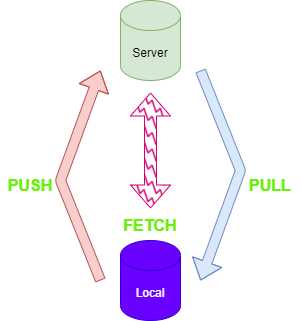

# WIFI Software Developer 2023
Hi all....

In this repository i will document the progress of the course and will add every week the learned content. 

## table of contents
- **Week 39**
   - [MarkDown basics](#item-md)
   - [GIT basics](#item-git)
  
- **Week 40**
   - [VisualStudio basics](#item-vs)
   - [VisualStudio basics 2](#item-vs2)
 
 - **Week 41**
   - [...](#item-??)
   - [...](#item-??)

## MarkDown basics

    We have learned the basics of creating Readme.md and tried out different tools for creatigng graphics, ...
    e.g. draw.io as VS-Code extension.

    enumerations

- one
- two
- five
- 

    Tables

|Day|Count|
|-----:|:-------:|
|Monday|12|
|Tuesday|15|
|Wednesday|20|
|Thursday|20|
|Friday|20|
|Saturday|20|
|Sunday|20|

[Zurück](#item-home)

## GIT basics

    We have set up our Git account and installed Fork. Then we have creared our own Git repository
    and cloned it to fork and VisualStudio.
Here are a few basic terms:

|term|explanation|
|---|---|
|PUSH|Synchronize the local state to the server|
|PULL|Synchronize the state on the server to the local repository|
|FETCH|Query where which changes are waiting for synchronization|

[Zurück](#item-home)

## VisualStudio basics

    We have learned the basics of .NET console applications and created our first "Hello World". 
    Further we learned the different datatypes and their usage and made some sample applications
    with these.

Here are some useful key shortcuts:

|shortcut|explanation|
|---|---|
|STRG+R+R|Rename a variable at all points of use|
|STRG+K+C|Comment out the selected lines|
|STRG+K+U|Uncomment the selected lines|

[Zurück](#item-home)

## VisualStudio basics 2

    In this lesson we have learned querys and inputs with the console. We have created our first 
    "intelligent" application with which we can perform simple calculations. Further we have learned 
    to make them safe with exceptions.

### learned commands

- Console.Write(Line)
- Console.Readline
- Console.SetCursorPosition
- Parse
- if/else
- try/catch

[Zurück](#item-home)
